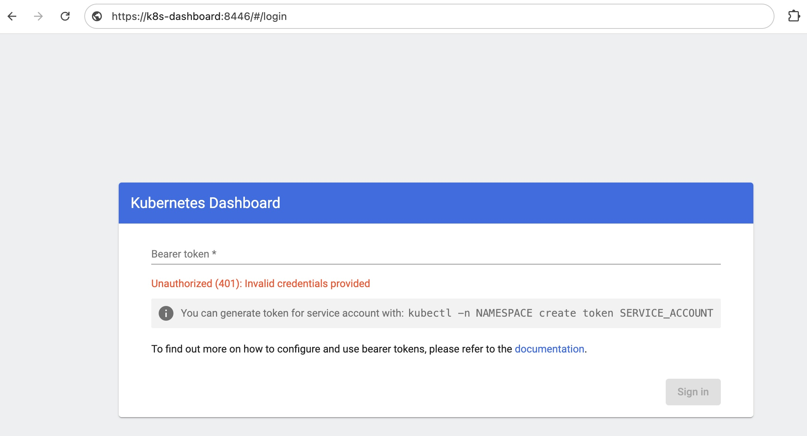
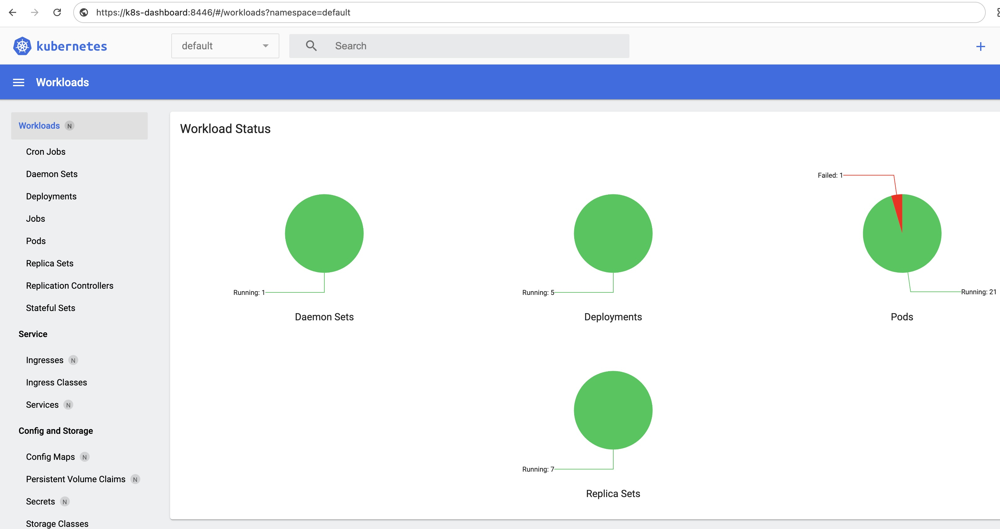
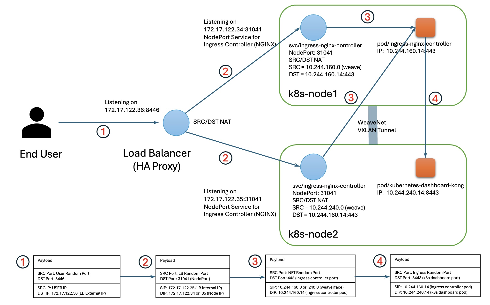

#### Exposing Kubernetes Dashboard UI

In this article, I'd like to share my experience with exposing the K8S Dashboard via a NodePort Service and an External Load Balancer. Most guides on the Internet recommend configuring (port-forwarding)[https://github.com/kubernetes/dashboard/blob/master/docs/user/accessing-dashboard/README.md]. While this might work for an individual administrator, it's not ideal if you want to provide access to the Dashboard to the entire organization. Here, I'll provide a detailed guide on how to achieve this.

##### Installing the Dashboard
First, you need to install the Dashboard. The installation process is thoroughly discribed in the [official guide](https://github.com/kubernetes/dashboard):
```
# Add kubernetes-dashboard repository
helm repo add kubernetes-dashboard https://kubernetes.github.io/dashboard/
# Deploy a Helm Release named "kubernetes-dashboard" using the kubernetes-dashboard chart
helm upgrade --install kubernetes-dashboard kubernetes-dashboard/kubernetes-dashboard --create-namespace --namespace kubernetes-dashboard
```
Now you've got your K8S Dashboard up and running:
```
$ k get all -n kubernetes-dashboard
NAME                                                        READY   STATUS    RESTARTS   AGE
pod/kubernetes-dashboard-api-75998575dd-hh2t5               1/1     Running   0          22d
pod/kubernetes-dashboard-auth-794b456fc5-zsffn              1/1     Running   0          22d
pod/kubernetes-dashboard-kong-7696bb8c88-xxh5s              1/1     Running   0          22d
pod/kubernetes-dashboard-metrics-scraper-5485b64c47-xksfq   1/1     Running   0          22d
pod/kubernetes-dashboard-web-84f8d6fff4-nnpcp               1/1     Running   0          22d

NAME                                           TYPE        CLUSTER-IP       EXTERNAL-IP   PORT(S)                         AGE
service/kubernetes-dashboard-api               ClusterIP   10.101.163.37    <none>        8000/TCP                        22d
service/kubernetes-dashboard-auth              ClusterIP   10.106.120.166   <none>        8000/TCP                        22d
service/kubernetes-dashboard-kong-manager      NodePort    10.111.27.70     <none>        8002:32176/TCP,8445:30810/TCP   22d
service/kubernetes-dashboard-kong-proxy        ClusterIP   10.106.133.114   <none>        443/TCP                         22d
service/kubernetes-dashboard-metrics-scraper   ClusterIP   10.101.47.41     <none>        8000/TCP                        22d
service/kubernetes-dashboard-web               ClusterIP   10.108.11.88     <none>        8000/TCP                        22d

NAME                                                   READY   UP-TO-DATE   AVAILABLE   AGE
deployment.apps/kubernetes-dashboard-api               1/1     1            1           22d
deployment.apps/kubernetes-dashboard-auth              1/1     1            1           22d
deployment.apps/kubernetes-dashboard-kong              1/1     1            1           22d
deployment.apps/kubernetes-dashboard-metrics-scraper   1/1     1            1           22d
deployment.apps/kubernetes-dashboard-web               1/1     1            1           22d

NAME                                                              DESIRED   CURRENT   READY   AGE
replicaset.apps/kubernetes-dashboard-api-75998575dd               1         1         1       22d
replicaset.apps/kubernetes-dashboard-auth-794b456fc5              1         1         1       22d
replicaset.apps/kubernetes-dashboard-kong-7696bb8c88              1         1         1       22d
replicaset.apps/kubernetes-dashboard-metrics-scraper-5485b64c47   1         1         1       22d
replicaset.apps/kubernetes-dashboard-web-84f8d6fff4               1         1         1       22d
```
Once the K8S Dashboard is up and running, you'll notice that the UI is not accessible from outside the K8S cluster. This is because you need to expose the CLusterIP service ````kubernetes-dashboard-kong-proxy```` in the ````kubernetes-dashboard```` namespace. The the most flexible way to do this is through an Ingress object.

##### Setting Up the Ingress Controller
An Ingress object is a K8S abstraction that requires a backend or ````Ingress Controller```` to be useful. I will install the [NGINX Controller](https://kubernetes.github.io/ingress-nginx/deploy/), one of the most popular options.
```
helm upgrade --install ingress-nginx ingress-nginx \
  --repo https://kubernetes.github.io/ingress-nginx \
  --namespace ingress-nginx --create-namespace
```
First, ensure that the Ingress Controller is up and running:
```
$ k get all -n ingress-nginx
NAME                                           READY   STATUS    RESTARTS   AGE
pod/ingress-nginx-controller-cf668668c-d5gr5   1/1     Running   0          22d

NAME                                         TYPE           CLUSTER-IP      EXTERNAL-IP   PORT(S)                      AGE
service/ingress-nginx-controller             LoadBalancer   10.103.236.98   <pending>     80:32132/TCP,443:31041/TCP   22d
service/ingress-nginx-controller-admission   ClusterIP      10.107.86.3     <none>        443/TCP                      22d

NAME                                       READY   UP-TO-DATE   AVAILABLE   AGE
deployment.apps/ingress-nginx-controller   1/1     1            1           22d

NAME                                                 DESIRED   CURRENT   READY   AGE
replicaset.apps/ingress-nginx-controller-cf668668c   1         1         1       22d
```
Since I am using a custom K8S setup without an integrated load balancer, there is no external IP assigned to the ````ingress-nginx-controller```` service. Therefore, I will set up another virtual machine and configure my own load balancer using [HA Proxy](https://www.haproxy.org/). The configuration is straightforward:
```
sudo tee -a /etc/haproxy/haproxy.cfg << EOF
frontend k8s-dashboard
    bind 172.17.122.36:8446
    option tcplog
    mode tcp
    default_backend k8s-dashboard

backend k8s-dashboard
    mode tcp
    balance roundrobin
    option tcp-check
    server k8s-node1 172.17.122.34:31041 check fall 3 rise 2
    server k8s-node2 172.17.122.35:31041 check fall 3 rise 2
EOF
```
The load balancer listens on port 8446 and forwards all incoming TCP packets to two K8S worker nodes ````172.17.122.34:31041```` and ````172.17.122.35:31041````, where the ````ingress-nginx-controller```` NodePort service is listening. How does the Ingress Controller know that an incoming request is intended for the K8S dashboard service? It doesn't, until you configure the NGINX pod running in the backend of the Ingress Controller Service. Fortunately, you don't need to do it manually. K8S provides an abstract object called "Ingress". Once you create or update the ````Ingress```` object, K8S automatically translates your "intent" into an NGINX configuration (or any other Ingress Controller you have chosen). The Ingress Controller continuously monitors the Kubernetes API server for changes to Ingress resources, and updates the underlying load balancer or proxy server (such as NGINX) accordingly.

##### Securing the Communication
To secure the communication between external user and the Ingress Controller, you need to generate a certificate. Below is an example of a self-signed certificate:
```
openssl req -x509 -nodes -days 365 -newkey rsa:2048 -keyout dashboard.key -out dashboard.crt -subj "/CN=k8s-dashboard"
```
Create a TLS secret from a generated key and certificate:
```
kubectl -n kubernetes-dashboard create secret generic kubernetes-dashboard-certs --from-file=tls.crt=dashboard.crt --from-file=tls.key=dashboard.key
```

##### Creating the Ingress Object
Now, create the Ingress object named ````dashboard-ingress-tls````:
```
cat <<EOF | kubectl apply -f -
apiVersion: networking.k8s.io/v1
kind: Ingress
metadata:
  annotations:
    kubernetes.io/ingress.class: public
    nginx.ingress.kubernetes.io/backend-protocol: HTTPS
    nginx.ingress.kubernetes.io/use-regex: "true"
  name: dashboard-ingress-tls
  namespace: kubernetes-dashboard
spec:
  ingressClassName: nginx
  rules:
  - host: k8s-dashboard
    http:
      paths:
      - backend:
          service:
            name: kubernetes-dashboard-kong-proxy
            port:
              number: 443
        path: /.*
        pathType: ImplementationSpecific
  tls:
  - hosts:
    - k8s-dashboard
    secretName: kubernetes-dashboard-certs
EOF
```
The Ingress object is ready:
```
$ k get ingress dashboard-ingress-tls -n kubernetes-dashboard
NAME                    CLASS   HOSTS           ADDRESS   PORTS     AGE
dashboard-ingress-tls   nginx   k8s-dashboard             80, 443   23d
```
Once the Ingress object is created, you can monitor the changes in the Ingress Controller configuration. K8S reconfigures the Ingress Controller automatically: 
```
$ k exec ingress-nginx-controller-cf668668c-d5gr5  -n ingress-nginx -- cat /etc/nginx/nginx.conf | grep dashboard
	## start server k8s-dashboard
		server_name k8s-dashboard ;
			set $namespace      "kubernetes-dashboard";
			set $ingress_name   "dashboard-ingress-tls";
			set $service_name   "kubernetes-dashboard-kong-proxy";
			set $proxy_upstream_name "kubernetes-dashboard-kubernetes-dashboard-kong-proxy-443";
			set $namespace      "kubernetes-dashboard";
			set $ingress_name   "dashboard-ingress-tls";
	## end server k8s-dashboard
```

##### Accessing the K8S Dashboard
With everything set up, you can access the K8S dashboard from outside of the cluster. As you can see, K8S requires authorization for the request:


Create a service account:
```
k create sa -n kubernetes-dashboard k8s-dashboard
```
Assign the predefined ````view```` cluster role to the ````k8s-dashboard```` service account in the ````kubernetes-dashboard```` namespace:
```
k create clusterrolebinding k8s-dashboard --clusterrole=view --serviceaccount=kubernetes-dashboard:k8s-dashboard
```
Create a token associated with the ````k8s-dashboard```` service account:
```
kubectl -n kubernetes-dashboard create token k8s-dashboard 
```
Copy the token and now you can access the K8S Dashboard from outside of the cluster. This approach allows to expose any service within the K8S cluster.


##### Networking Perspective
As a network engineer, I find it fascinating to understand what happens under the hood when you create these abstract k8s objects. Here is how the communication looks from the networking perspective:


1. The end user enters the Dashboard URL in their browser. Once the DNS name is resolved, the request is forwarded to the Load Balancer. 

2. The Load Balancer (HA proxy in this case) performs SRC and DST NAT and forwards the request to the backend endpoints: 172.17.122.34:31041 or 172.17.122.35.31041.

3. Upon entering the node, the request is processed through the chains of ````nft```` rules on the worker node. Analyzing the rules in the **nat** table shows the following chains are used: ````KUBE-SERVICES -> KUBE-NODEPORTS -> KUBE-EXT-EDNDUDH2C75GIR6O -> KUBE-MARK-MASQ -> KUBE-SVC-EDNDUDH2C75GIR6O -> KUBE-SEP-4QEXFZIGX6GRNBQ6 -> KUBE-POSTROUTING````

The **KUBE-SERVICES** chain forwards the incoming packet to the **KUBE-NODEPORTS** chain:
```
aantonov@k8s-node1:~$ sudo nft list chain nat KUBE-SERVICES
table ip nat {
  chain KUBE-SERVICES {
    meta l4proto tcp ip daddr 10.96.0.10  tcp dport 9153 counter packets 0 bytes 0 jump KUBE-SVC-JD5MR3NA4I4DYORP
    meta l4proto tcp ip daddr 10.111.27.70  tcp dport 8002 counter packets 0 bytes 0 jump KUBE-SVC-7AZRESQFPW3OJDED
    meta l4proto tcp ip daddr 10.111.27.70  tcp dport 8445 counter packets 0 bytes 0 jump KUBE-SVC-VA6PIYC5VKKTCG7Z
    meta l4proto tcp ip daddr 10.106.120.166  tcp dport 8000 counter packets 0 bytes 0 jump KUBE-SVC-R565IXFGCJUYO2JX
    meta l4proto tcp ip daddr 10.101.47.41  tcp dport 8000 counter packets 0 bytes 0 jump KUBE-SVC-PO536MSUZGLPFHIC
    meta l4proto tcp ip daddr 10.103.236.98  tcp dport 80 counter packets 0 bytes 0 jump KUBE-SVC-CG5I4G2RS3ZVWGLK
    meta l4proto tcp ip daddr 10.107.86.3  tcp dport 443 counter packets 0 bytes 0 jump KUBE-SVC-EZYNCFY2F7N6OQA2
    meta l4proto tcp ip daddr 10.108.11.88  tcp dport 8000 counter packets 0 bytes 0 jump KUBE-SVC-Z3G5L5WVMR7I7V6E
    meta l4proto tcp ip daddr 10.96.89.41  tcp dport 80 counter packets 0 bytes 0 jump KUBE-SVC-XHGAOGCFMA56WJQ6
    meta l4proto tcp ip daddr 10.104.56.128  tcp dport 80 counter packets 0 bytes 0 jump KUBE-SVC-ND4H345MT4XKVZOF
    meta l4proto tcp ip daddr 10.101.163.37  tcp dport 8000 counter packets 0 bytes 0 jump KUBE-SVC-UH355S5XFIICXZAT
    meta l4proto tcp ip daddr 10.103.236.98  tcp dport 443 counter packets 0 bytes 0 jump KUBE-SVC-EDNDUDH2C75GIR6O
    meta l4proto udp ip daddr 10.96.0.10  udp dport 53 counter packets 0 bytes 0 jump KUBE-SVC-TCOU7JCQXEZGVUNU
    meta l4proto tcp ip daddr 10.96.0.10  tcp dport 53 counter packets 0 bytes 0 jump KUBE-SVC-ERIFXISQEP7F7OF4
    meta l4proto tcp ip daddr 10.106.133.114  tcp dport 443 counter packets 0 bytes 0 jump KUBE-SVC-3JWJBWA3QD3XT7IS
    meta l4proto tcp ip daddr 10.96.0.1  tcp dport 443 counter packets 0 bytes 0 jump KUBE-SVC-NPX46M4PTMTKRN6Y
     fib daddr type local counter packets 813 bytes 48892 jump KUBE-NODEPORTS
  }
}
```
The **KUBE-NODEPORTS** chain forwards the incoming packet to the **KUBE-EXT-EDNDUDH2C75GIR6O** chain:
```
aantonov@k8s-node1:~$ sudo nft list chain nat KUBE-NODEPORTS
table ip nat {
  chain KUBE-NODEPORTS {
    meta l4proto tcp  tcp dport 32176 counter packets 0 bytes 0 jump KUBE-EXT-7AZRESQFPW3OJDED
    meta l4proto tcp  tcp dport 30810 counter packets 0 bytes 0 jump KUBE-EXT-VA6PIYC5VKKTCG7Z
    meta l4proto tcp  tcp dport 32132 counter packets 0 bytes 0 jump KUBE-EXT-CG5I4G2RS3ZVWGLK
    meta l4proto tcp  tcp dport 30777 counter packets 0 bytes 0 jump KUBE-EXT-XHGAOGCFMA56WJQ6
    meta l4proto tcp  tcp dport 31041 counter packets 680 bytes 40800 jump KUBE-EXT-EDNDUDH2C75GIR6O
  }
}
```
The **KUBE-EXT-EDNDUDH2C75GIR6O** chain forwards the incoming packet to the **KUBE-EXT-EDNDUDH2C75GIR6O** chain:
```
aantonov@k8s-node1:~$ sudo nft list chain nat KUBE-EXT-EDNDUDH2C75GIR6O
table ip nat {
  chain KUBE-EXT-EDNDUDH2C75GIR6O {
     counter packets 102710 bytes 6162600 jump KUBE-MARK-MASQ
    counter packets 102710 bytes 6162600 jump KUBE-SVC-EDNDUDH2C75GIR6O
  }
}
```
The **KUBE-MARK-MASQ** chain marks the incoming packet, and then the next rule is evaluated in the **KUBE-EXT-EDNDUDH2C75GIR6O** chain:
```
aantonov@k8s-node1:~$ sudo nft list chain nat KUBE-MARK-MASQ
table ip nat {
  chain KUBE-MARK-MASQ {
    counter packets 686 bytes 41160 meta mark set mark or 0x4000
  }
}
```
The **KUBE-SVC-EDNDUDH2C75GIR6O** chain forwards the incoming packet to the **KUBE-SEP-4QEXFZIGX6GRNBQ6** chain:
```
aantonov@k8s-node1:~$ sudo nft list chain nat KUBE-SVC-EDNDUDH2C75GIR6O
table ip nat {
  chain KUBE-SVC-EDNDUDH2C75GIR6O {
    meta l4proto tcp ip saddr != 10.244.0.0/16 ip daddr 10.103.236.98  tcp dport 443 counter packets 0 bytes 0 jump KUBE-MARK-MASQ
     counter packets 102717 bytes 6163020 jump KUBE-SEP-4QEXFZIGX6GRNBQ6
  }
}
```
The **KUBE-SEP-4QEXFZIGX6GRNBQ6** chain performs DST NAT, replacing the DST_IP/PORT 172.17.122.34:31041 with 10.244.160.14:443 (pod/ingress-nginx-controller):
```
aantonov@k8s-node1:~$ sudo nft list chain nat KUBE-SEP-4QEXFZIGX6GRNBQ6
table ip nat {
  chain KUBE-SEP-4QEXFZIGX6GRNBQ6 {
    ip saddr 10.244.160.14  counter packets 0 bytes 0 jump KUBE-MARK-MASQ
    meta l4proto tcp   counter packets 102725 bytes 6163500 dnat to 10.244.160.14:443
  }
}
**KUBE-POSTROUTING** chain performs ```masquerading``` replacing SRC IP with the IP address of the outgoing interface, 10.244.160.0 on node1 and 10.244.240.0 on node2.
```
```
aantonov@k8s-node2:~$ ip a sh dev weave
4: weave: <BROADCAST,MULTICAST,UP,LOWER_UP> mtu 65535 qdisc noqueue state UP group default qlen 1000
    link/ether 46:05:8f:4a:12:41 brd ff:ff:ff:ff:ff:ff
    inet 10.244.240.0/16 brd 10.244.255.255 scope global weave
       valid_lft forever preferred_lft forever
    inet6 fe80::4405:8fff:fe4a:1241/64 scope link
       valid_lft forever preferred_lft forever

```
```
aantonov@k8s-node1:~$ ip a sh dev weave
4: weave: <BROADCAST,MULTICAST,UP,LOWER_UP> mtu 65535 qdisc noqueue state UP group default qlen 1000
    link/ether 06:b9:64:54:7a:19 brd ff:ff:ff:ff:ff:ff
    inet 10.244.160.0/16 brd 10.244.255.255 scope global weave
       valid_lft forever preferred_lft forever
    inet6 fe80::4b9:64ff:fe54:7a19/64 scope link
       valid_lft forever preferred_lft forever
```
```
aantonov@k8s-node1:~$ sudo nft list chain nat KUBE-POSTROUTING
table ip nat {
  chain KUBE-POSTROUTING {
    meta mark & 0x00004000 != 0x00004000 counter packets 1636 bytes 98465 return
    counter packets 1008 bytes 60480 meta mark set mark xor 0x4000
     counter packets 1008 bytes 60480 masquerade
  }
}
```

4. The ````pod/ingress-nginx-controller```` then receives the packet with the SRC_IP=10.244.160.0 (or 10.244.240.0) and DST_IP=10.244.160.14:443, indicating that the packet is intended for this pod. NGINX processes the packet and forwards it to the endpoint. 
```
aantonov@k8s-node2:~$ sudo ip netns exec cni-6b22e4d9-2c03-d5dd-20f0-7e9e1c811e87 ip a sh
1: lo: <LOOPBACK,UP,LOWER_UP> mtu 65536 qdisc noqueue state UNKNOWN group default qlen 1000
    link/loopback 00:00:00:00:00:00 brd 00:00:00:00:00:00
    inet 127.0.0.1/8 scope host lo
       valid_lft forever preferred_lft forever
    inet6 ::1/128 scope host
       valid_lft forever preferred_lft forever
130: eth0@if131: <BROADCAST,MULTICAST,UP,LOWER_UP> mtu 65535 qdisc noqueue state UP group default
    link/ether 06:be:75:3f:3d:78 brd ff:ff:ff:ff:ff:ff link-netnsid 0
    inet 10.244.240.14/16 brd 10.244.255.255 scope global eth0
       valid_lft forever preferred_lft forever
    inet6 fe80::4be:75ff:fe3f:3d78/64 scope link
       valid_lft forever preferred_lft forever

aantonov@k8s-node2:~$ sudo ip netns exec cni-6b22e4d9-2c03-d5dd-20f0-7e9e1c811e87 tcpdump -nvvvi eth0
tcpdump: listening on eth0, link-type EN10MB (Ethernet), snapshot length 262144 bytes
20:19:43.790368 IP (tos 0x0, ttl 64, id 8213, offset 0, flags [DF], proto TCP (6), length 60)
    10.244.160.14.51372 > 10.244.240.14.8443: Flags [S], cksum 0x6821 (correct), seq 3372043726, win 65495, options [mss 65495,sackOK,TS val 2664472729 ecr 0,nop,wscale 7], length 0
20:19:43.790462 IP (tos 0x0, ttl 64, id 0, offset 0, flags [DF], proto TCP (6), length 60)
    10.244.240.14.8443 > 10.244.160.14.51372: Flags [S.], cksum 0x037a (correct), seq 2011432633, ack 3372043727, win 65483, options [mss 65495,sackOK,TS val 2726249349 ecr 2664472729,nop,wscale 7], length 0
20:19:43.791717 IP (tos 0x0, ttl 64, id 8214, offset 0, flags [DF], proto TCP (6), length 52)
    10.244.160.14.51372 > 10.244.240.14.8443: Flags [.], cksum 0x2a34 (correct), seq 1, ack 1, win 512, options [nop,nop,TS val 2664472731 ecr 2726249349], length 0
20:19:43.792403 IP (tos 0x0, ttl 64, id 8215, offset 0, flags [DF], proto TCP (6), length 345)
    10.244.160.14.51372 > 10.244.240.14.8443: Flags [P.], cksum 0x8a91 (correct), seq 1:294, ack 1, win 512, options [nop,nop,TS val 2664472732 ecr 2726249349], length 293
```
You might wonder why the packet isn't sent to the ClusterIP 10.106.133.114:443 of the ```kubernetes-dashboard-kong-proxy``` service. This additional step is unnecessary because the Ingress Controller already knows about the service endpoints. Thus, it can directly communicate between pods without involving extra DST NAT.
```
aantonov@k8s-cp1:~$ k describe ingress -n kubernetes-dashboard
Name:             dashboard-ingress-tls
Labels:           <none>
Namespace:        kubernetes-dashboard
Address:
Ingress Class:    nginx
Default backend:  <default>
TLS:
  kubernetes-dashboard-certs terminates k8s-dashboard
Rules:
  Host           Path  Backends
  ----           ----  --------
  k8s-dashboard
                 /.*   kubernetes-dashboard-kong-proxy:443 (10.244.240.14:8443)
Annotations:     kubernetes.io/ingress.allow-http: false
                 kubernetes.io/ingress.class: public
                 nginx.ingress.kubernetes.io/backend-protocol: HTTPS
                 nginx.ingress.kubernetes.io/use-regex: true
Events:          <none>
```
Traffic in the opposite direction follows the same path. 

